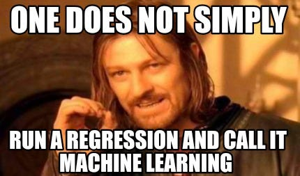

# Welcome to Risk Modeling for the impatient

This website is designed for those who 

- wants to break into risk modeling in a bank institution but lack of domain knowledge
- has STEM background (basic math is needed)

### What You'll Learn

- **Foundations of Risk Modeling**: Understand key concepts, technical jargon and some domain specific knowledge
- **Risk Modeling**: Learning about PD, LGD and EAD model
- **Advanced Topics**: Explore more complex areas of risk modeling, including stress testing, scenario analysis, and financial forecasting.

### Join Our Community

Be part of a community of like-minded professionals who are expanding their expertise into risk modeling. Share your progress, ask questions, and network with peers and experts.

[To be continuted, probably gonna be a slack and discord channel]

