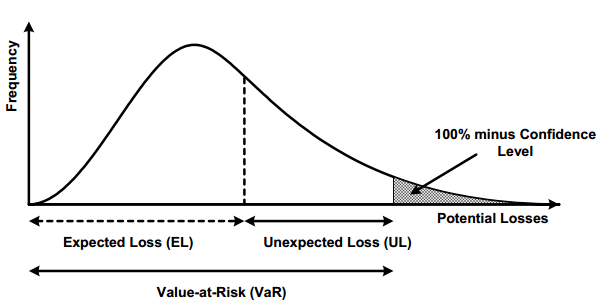
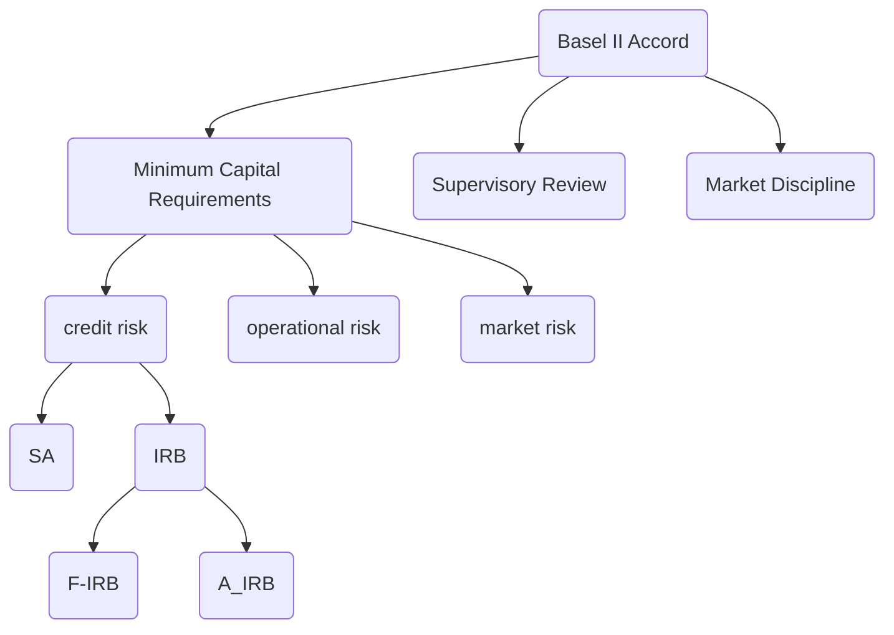

# Risk Modeling Notes

Table of contents
- [Risk Modeling Notes](#risk-modeling-notes)
  - [Overview](#overview)
    - [Key Components of a Scorecard Model](#key-components-of-a-scorecard-model)
    - [How Banks Use Scorecard Models](#how-banks-use-scorecard-models)
    - [Building a Scorecard Model](#building-a-scorecard-model)
    - [Summary](#summary)
  - [EL, PD, LGD and EAD](#el-pd-lgd-and-ead)
  - [Overview](#overview-1)
  - [EL, PD, LGD and EAD](#el-pd-lgd-and-ead-1)
    - [EL](#el)
  - [Capital adequacy, regulations and the Base II accord](#capital-adequacy-regulations-and-the-base-ii-accord)
  - [Basel II](#basel-ii)
  - [Different facility types](#different-facility-types)

## Overview

Risk modeling is the bread and butter for bank. At the end of the day, risk model delivers scorecard looks like this, 

There are primarily two types of scorecards used in banking:

- `Application Scorecard`: Used to evaluate new loan applicants. The model considers factors such as credit history, income, employment status, and debt-to-income ratio to determine the likelihood of the applicant repaying the loan.

- `Behavioral Scorecard`: Used for existing customers, typically to assess the likelihood of default based on past account behavior. It considers factors like payment history, account balances, recent transactions, and usage patterns.

The application score card will base on your age, income, credit history etc to assessing risk to see if your score is over the cutoff, binary classification problem.

### Key Components of a Scorecard Model

Variables: The scorecard uses variables or features (e.g., age, income, credit history) relevant to assessing credit risk.

- `Weightings`: Each variable is assigned a weight based on its predictive power. The more influential a variable, the higher its weight.

- `Score`: The model produces a credit score, often ranging from 300 to 850 in consumer credit scoring systems like FICO. Higher scores indicate lower credit risk.

- `Cutoff Score`: Banks set a cutoff score, above which applicants are approved and below which they may be rejected or subjected to additional scrutiny.

### How Banks Use Scorecard Models
- `Credit Approval`: Banks use scorecards to automatically decide whether to approve or reject loan applications. This helps streamline the approval process.

- `Risk-Based Pricing`: The score determines the interest rate offered to a borrower. Higher-risk customers may be charged higher rates to offset the risk of default.

- `Regulatory Compliance`: Scorecards support compliance with regulatory requirements by providing objective, data-driven criteria for lending decisions.
- `Portfolio Management`: Behavioral scorecards help banks monitor existing customers and proactively manage credit limits, upgrade or downgrade products, and initiate early intervention if a customer’s risk profile changes.

- `Fraud Detection`: Scorecard models can include features related to transaction behavior and account activity to detect potential fraud.

### Building a Scorecard Model

Building a scorecard typically involves the following steps:

- `Data Collection`: Historical data on customer profiles and loan performance.
- `Feature Engineering`: Selecting and transforming features that are predictive of risk.
- `Model Development`: Using statistical techniques like logistic regression, decision trees, or machine learning to create a predictive model.
- `Model Validation`: Testing the model on out-of-sample data to ensure accuracy.
Deployment and Monitoring: Implementing the model in production and monitoring its performance over time to adjust for changes in customer behavior or economic conditions.
Scorecard models are central to credit risk management, allowing banks to make informed lending decisions and maintain a balanced portfolio while minimizing the risk of defaults.

### Summary

In this section, we talked about how risk model used in a bank's setting.

## EL, PD, LGD and EAD

Three types

- PD (Probability Default)
- LGD (Loss Given Default)
- EAD (Exposure At Default)

EL(expected loss) = PD x LGD x EAD

EL is an indicator that mutiplicially decomposed to PD, LGD and EAD. 

Q:

- what's default?
- Basel II accord

## Overview

What is credit risk?

Creditor(lender) and debtor (Borrower) relationship and debtor typically borrow medium (money, home loan, credit card) with interest rate for incentive.

> Credit Risk: The likelyhood that a borrower would not repay their loan to the lender

- collection cost: creditor收钱的成本
- default: borrower没钱还了

To diminish deafult, it has two ways

- increase interested rate: AKA risk-based pricing
- require collaterals

> 主要还是预测probability of default, 也就是多大概率borrower还不上钱. 

## EL, PD, LGD and EAD

### EL

Loss分几部分

- EL (expected loss): affected by the credit risk. 
- UL (unexpected loss): result of adverse economic circumstances like financial crisis.
- Potential losses: unlikely to happen and hard to measure.

Our goal is to measure EL or expected credit loss. EL has three composition

|item|description|大白话|
|-|-|-|
|probability of default|The borrowers inability to repay their debt in full or on time|借债者多少概率还不上钱|
|loss given default (`LGD`)| The proportion of the total exposure that cannot be recoved by the lender once a default occurred|一旦还不上钱(default happens),多少资产银行拿不回来, 比如银行借了10万的loan, default了，拿回来4万，亏了6万。LGD就是6/10=60%, 也就是loss/loan ratio. |
|Exposure at default (`EAD`)| The total value that a leander is exposed to when a borrower defaults|假设borrower defaults|

LGD = outstanding loan balance - Recovery Amount

> Question:
> 有一个loaner要买一套50万的房子，loan to value为80%. 去年借钱买房子4人就有1个default, 所以PD=25%. loaner已经还了4万，如果default happen, assume银行能马上卖出房子，赚回34.2万，求expected loss.

$$
\begin{align}
EL = PD\times LGD \times EAD
\end{align}
$$

由于已经还了4万，EAD=40-4 = 36万。假设default and 卖掉房子后发现，必亏36-34.2=1.8万，

$$
\begin{equation}
LGD = \frac{18000}{360000} = 5\%
\end{equation}
$$

PD = 25% x 5% x 360000 = 4500

## Capital adequacy, regulations and the Base II accord

In this section we will cover,

- [Capital Adequacy Ratio](https://www.investopedia.com/terms/c/capitaladequacyratio.asp)
- Base II accords

为了避免像2008financial crisis这样的事情，出了一系列regulation, 比如

- capital requirement: 也叫capital adequacy or regulatory capital, 也就是银行有多少capital来应对default loss避免cost.

$$
\begin{equation}
CAR = \frac{Capital}{Risk-weighted assets} > \%
\end{equation}
$$
where CAR is capital adequacy ratio 

Basel II Accord

- how much capital banks need to have
- how capital is defined
- how capital is compared against risk-weighed assets

|-|-|description|-|
|-|-|-|-|
|SA|standardized approach|not flexible since all external|
|IRB|internal rating based
|F-IRB|Foundation IRB|
|A-IRB|Advanced IRB|

## Basel II

|-|SA|F-IRB|A-IRB|
|-|-|-|-|
|PD|Externally Provided|Internally estimated|Internally estimate|
|LGD|Externally Provided|Externally Provided|Internally estimate|
|EAD|Externally Provided|Externally Provided|Internally estimate|

> External provider的公司包括FICO, S&P Global, Moody's and Fitch Rating. (In US)

基本上银行业务的逻辑是, 

- SA --> F-IRB and A-IRB

由于SA都是external data source, regulator给的都是保守估计，所以给的要求RWA很大。所以单位capital能借出去的loan就更小,也就是更少收益。银行为了借出去更多的贷款，需要用别的regulator-approved approach来更精确calculate激进的RWA, 可以又合规又能借出去更多的钱.

>[!note]
> Credit score对于公司/政府一般是给A+,B++的rating, 对individual是numeric score.

## Different facility types

From section 1, ignore for now

