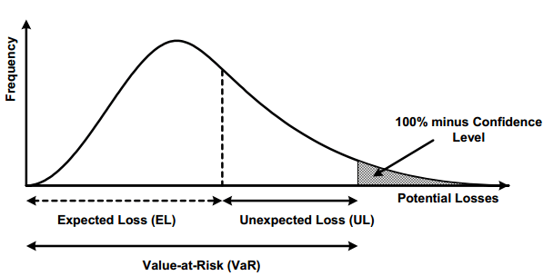

# Risk Model 101

## Overview

Risk modeling is the bread and butter for bank. At the end of the day, risk model delivers `scorecard` looks like this, 

There are primarily two types of scorecards used in banking:

- `Application Scorecard`: Used to evaluate new loan applicants. The model considers factors such as credit history, income, employment status, and debt-to-income ratio to determine whether bank will prove your loan or not. Boolean result

- `Behavioral Scorecard`: Used for existing customers, typically to assess the likelihood of default based on past account behavior. It considers factors like payment history, account balances, recent transactions, and usage patterns etc. It's a online-model since data will kick in at run time (probably not real time but monthly batched prob)

!!! note "ML in banking"
    Due to regulation, risk modeling uses non-convoluted and very explainable/interpretable model like logarithmic regression for starter.

The application score card will base on your age, income, credit history etc to assessing risk to see if your score is over the cutoff, binary classification problem.

### Key Components of a Scorecard Model

The scorecard uses variables or features (e.g., age, income, credit history) relevant to assessing credit risk.

- `Weightings`: Each variable is assigned a weight based on its predictive power. The more influential a variable, the higher its weight.
- `Score`: The model produces a credit score, often ranging from 300 to 850 in consumer credit scoring systems like FICO. Higher scores indicate lower credit risk.
- `Cutoff Score`: Banks set a cutoff score, above which applicants are approved and below which they may be rejected or subjected to additional scrutiny.

### How Banks Use Scorecard Models

- `Credit Approval`: Banks use scorecards to automatically decide whether to approve or reject loan applications. This helps streamline the approval process.
- `Risk-Based Pricing`: The score determines the interest rate offered to a borrower. Higher-risk customers may be charged higher rates to offset the risk of default.
- `Regulatory Compliance`: Scorecards support compliance with regulatory requirements by providing objective, data-driven criteria for lending decisions.
- `Portfolio Management`: Behavioral scorecards help banks monitor existing customers and proactively manage credit limits, upgrade or downgrade products, and initiate early intervention if a customer’s risk profile changes.
- `Fraud Detection`: Scorecard models can include features related to transaction behavior and account activity to detect potential fraud.

### Building a Scorecard Model

Building a scorecard typically involves the following steps:

- `Data Collection`: Historical data on customer profiles and loan performance.
- `Feature Engineering`: Selecting and transforming features that are predictive of risk.
- `Model Development`: Using statistical techniques like logistic regression, decision trees, or machine learning to create a predictive model.
- `Model Validation`: Testing the model on out-of-sample data to ensure accuracy.
Deployment and Monitoring: Implementing the model in production and monitoring its performance over time to adjust for changes in customer behavior or economic conditions.
Scorecard models are central to credit risk management, allowing banks to make informed lending decisions and maintain a balanced portfolio while minimizing the risk of defaults.

### Summary

In this section, we talked about how risk model used in a bank's setting and why it's needed. We shall dig in.

## Financial Jargons

In this section, we will learn

- what is credit risk?
- Why risk modeling

Those are the metrics we gonna center around and learn about 

### What is credit risk?

Imagine a relationship between Creditor(lender) and debtor (Borrower). Debtor typically borrow something (money, home loan, credit card) with interest rate for incentive of the lender. The lender has the profit of interest with the risk of borrower never pays back

- `collection cost`: the cost associated with how creditor get back the money
- `default`: an event that borrower has no money to pay. 

### Why risk modeling

If bank institution can have a handy tool that determines whether the borrower is trust-worthy or not, that will be awesome since it's directly related with their profit, take [RBC](https://www.rbcroyalbank.com/personal.html) for example, their revenue breakdown for the last couple of years are [(source)](https://www.tradingview.com/symbols/TSX-RY/financials-revenue/)

|-|2019|2020|2021|2022|2023|
|-|-|-|-|-|-|
|Personal and Commercial Banking|17.86B|17.73B|18.35B|20.14B|22.12B|
|Wealth Management|12.14B|12.22B|13.30B|14.85B|17.54B|
|Capital Markets|8.29B|9.88B|10.19B|9.12B|11.05B|
|Insurance|5.71B|5.36B|5.60B|3.51B|5.67B|
|Investor and Treasury Services|2.35B|2.21B|2.16B|2.22B|-|
|Corporate Support|-|-|100M|-|-|

The personal and commercial banking loan takes a huge chunk of business and that's the incentive behind developing these model. 

On the other hand, this industry is highly regulated. Regulator publish [Basel III](https://www.investopedia.com/terms/b/basell-iii.asp) accord to basically enforce bank institution to have enough money to survive if there are too many defaults. Bank has to implement it and so the risk modeling has two primary stakeholders:

- `stakeholder: regulator`: deliver model and its result to regulator. Be more careful with your results and interoperability
- `scorecard`: teams supporting scorecard for loan application etc

### EL, PD, LGD and EAD

We gonna learn four technical jargons that modeller cares and they are illustrated in the equation below

$$
\begin{equation}
EL = PD \times LGD \times EAD
\end{equation}
$$
where $EL$ is Expected Loss, $PD$ is Probability Default, $LGD$ is Loss Given Default and $EAD$ is Exposure At Default

EL is a type of loss where the total loss consists of EL, UL and potential loss

- EL (expected loss): affected by the credit risk. 
- UL (unexpected loss): result of adverse economic circumstances like financial crisis.
- Potential losses: unlikely to happen and hard to measure.

Only EL is able to be modelled and predicted as illustrated in the image below and that's the primary concern

Our goal is to measure EL or expected credit loss. EL has three composition

|item|description|大白话|
---|---|---
|probability of default|The borrowers inability to repay their debt in full or on time|借债者多少概率还不上钱|
|loss given default (`LGD`)| The proportion of the total exposure that cannot be recoved by the lender once a default occurred. LGD = outstanding loan balance - Recovery Amount|一旦还不上钱(default happens),多少资产银行拿不回来, 比如银行借了10万的loan, default了，拿回来4万，亏了6万。LGD就是6/10=60%, 也就是loss/loan ratio. |
|Exposure at default (`EAD`)| The total value that a leander is exposed to when a borrower defaults|假设borrower defaults,亏多少?|

!!! Question "Question"
    If some1 wants to buy a 0.5 million house, loan to value is 80%. Last year, 1 out of 5 people who defaults (Assuming PD=25%). loaner paid 40,000. what if happen, assuming bank can immediately auction the hour and get back 342,000. What's the EL?

equation of EL is,

$$
\begin{align}
EL = PD\times LGD \times EAD
\end{align}
$$

Since the loaner already paid 40,000, so the EAD is 
$$
\begin{equation}
EAD = 400,000 - 40,000 = 36,000
\end{equation}
$$

Assuming default and bank auctioned the house for another 342,000, bank will lose 36,000 - 342,000 = 18,000. We can use the loss to calculate LGD

$$
\begin{align}
LGD &= \frac{18000}{360000} = 5\% \\
PD &= 25\% \times 5\% \times 360000 = 4500
\end{align}
$$

Then the EL is self-explanatory

## Capital adequacy, regulations and the Basel Guideline

In this section we will cover,

- [Capital Adequacy Ratio](https://www.investopedia.com/terms/c/capitaladequacyratio.asp)
- Base II accords

To avoid financial crisis like the one happened in 2008, a series of regulation has been proposed and bank have to adhere to like the capial requirement.

capital requirement: AKA capital adequacy or regulatory capital. It's the minimum amount of money the bank should have to recover default loss.

$$
\begin{equation}
CAR = \frac{Capital}{\text{Risk-weighted assets}} > \%
\end{equation}
$$
where CAR is capital adequacy ratio 

!!! warning
    Besides Basel III, you will also hear [IFRS 9](https://www.youtube.com/watch?v=5CAWuNaoecY). They have different guidelines for
    - classifying assets 
    - PD model for example.
    - time measurement

    \

Basel II Accord

- how much capital banks need to have
- how capital is defined
- how capital is compared against risk-weighed assets

An overview of the Basel Accord is shown in the flowchart below

|-|-|description|
|-|-|-|-|
|SA|standardized approach|not flexible since all external|
|IRB|internal rating based|-|
|F-IRB|Foundation IRB|-|
|A-IRB|Advanced IRB|-|

### Basel II

|-|SA|F-IRB|A-IRB|
|-|-|-|-|
|PD|Externally Provided|Internally estimated|Internally estimate|
|LGD|Externally Provided|Externally Provided|Internally estimate|
|EAD|Externally Provided|Externally Provided|Internally estimate|

!!! tip "External Provider in USA"
    In USA, Popular External provider includes FICO, S&P Global, Moody's and Fitch Rating.

基本上银行业务的逻辑是, always starts from SA, then to F-IRB and A-IRB. 

由于SA都是external data source, regulator给的都是保守估计，所以给的要求RWA很大。所以单位capital能借出去的loan就更小,也就是更少收益。银行为了借出去更多的贷款，需要用别的regulator-approved approach来更精确calculate激进的RWA, 可以又合规又能借出去更多的钱.

!!! tip "rating system"
    Credit score对于公司/政府一般是给A+,B++的rating, 对individual是numeric score.

