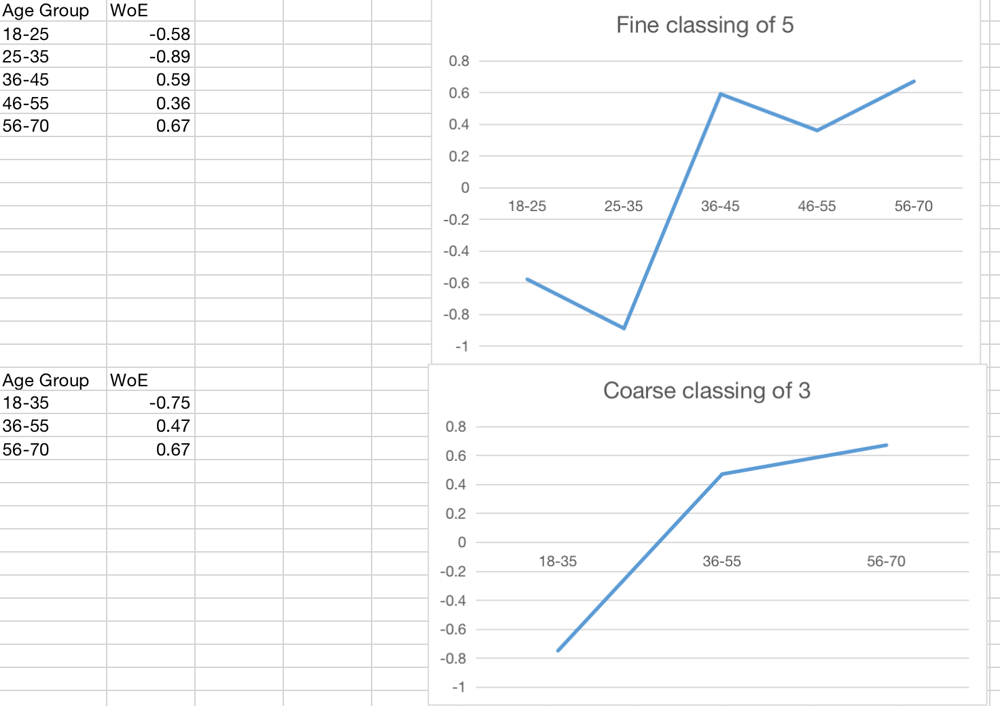

# WOE and IV

In this section, we will talk about **WoE (weight of evidence)** and **IV(information value)** in the context of logistic regression for risk modeling.

## Introduction

WoE, in the context of risk modelling does three things, 

- `binning of feature` such that it's monotonic to reduce statistical noise by removing non-linearity. And feature's interoperability (at the cost of losing prediction power)
- `Substitute Continuous Variable`: Use age for example, convert age --> age group and then calculate their respective $WoE_i$ for each age group. Use $WoE_i$ instead of age-group in the logistic model, labelled as age.
- `Substitute Categorical `:

!!! tip
    `WoE` and `IV` is useful for feature binning but limited only in binary classification, usually logistic regression. If modeller wish to try out different model like SVM, you have to use other binning strategy. It is due to SVM can capture non-linear relationship between predictor and target value. If you only use WoE, which require monotonicity, you will end up losing the non-linearity feature which serves no good for non-linear model like SVM.

## WOE and IV Math Formulation

Let's assume our target value of 1 as good and 0 as bad, 

$WoE_i$ (weight of evidence) is defined as

$$
\begin{align}
WoE_i &= ln\left(\frac{\textbf{num of good in class i}}{\textbf{num of total good}}\right) - ln\left(\frac{\textbf{num of bad in class i}}{\textbf{num of total bad}}\right)\\
&= ln\left(\frac{\%\textbf{ of good in class i}}{\%\textbf{ of bad in class i}}\right)\\
\end{align}
$$

where $WoE_i$ is the weight of evidence for $i$ th bin, % of good in class is also called distribution of good in some texts.

As for $IV_i$, it's dependent on 

$$
\begin{align}
IV_i &= WoE_i \times \left(\textbf{\% of good in class i} - \textbf{\% of bad in class i}\right)\\
\text{IV} &= \sum_{i=1}^{n} IV_i
\end{align}
$$
We typically talk about information value as $\sum_{i=1}^{n} IV_i$ 

## WoE Intuition

WoE is useful for binning, let's say continuous variable like age. Binning or bucketing is often used to convert

For example, 

|Age Group|Good|Bad|WoE|IV|
--- | --- | --- | --- | --- 
|18-35|2000|400|-0.75|0.23|
|36-55|3402|201|0.47|0.08|
|56-70|1900|92|0.67|0.09|
|Total|7302|693|-|0.4|

If we draw out diagram, due to it's logarithmic nature

In feature engineering, some questions naturally arises, such as 

- weight of evidence (WOE) values maintain a monotonic relationship with the 1/0 variable (loan default or not default for example.)
- each bin is reasonably sized and large enough to be representative of population segments,
- Optimize IV value in the process of binning (iterative process)

### WoE Derivation

It's bugging me where the jargon $WoE$ is from. It turns out nothing but a ratio that obtainable by substituting linear model to sigmoid function will yield WoE, (add equations here)

Recall sigmoid and its derivative

$$
\begin{align}
y = \frac{1}{1 + e^{-z}} \\
y^{'} = y\times \left(1-y\right)
\end{align}
$$

For sigmoid we can have,

$$
\begin{align}
y &= \frac{1}{1 + e^{-z}} = \frac{e^{z}}{1 + e^{z}}\\
1 - y &= \frac{1 + e^{z}}{1 + e^{z}} - \frac{e^{z}}{1 + e^{z}} = \frac{1}{1 + e^{z}}\\
\frac{y}{1-y} &= e^{z}
\end{align}
$$

Then we write the linear regression in matrix form

$$
\begin{equation}
z = \omega^{T}x + b
\end{equation}
$$

We substitute the linear regression to $\frac{1}{1-y} = e^{z}$ and take log on both sides

$$
\begin{align}
\frac{y}{1-y} &= e^{\omega^{T}x + b} \\
\ln \frac{y}{1-y} &= \omega^{T}x + b \\
\end{align}
$$

where $y$ being good, $1-y$ being bad, $\omega$ and $b$ are the parameters we need to optimize for our objective function.

We can then write the above formation in another form

$$
\begin{align}
\ln \frac{P\left(y=1 \mid x \right)}{P\left(y=0 \mid x \right)} &= \omega^{T}x + b \\
\end{align}
$$

!!! note
    $P\left(y=1 \mid x \right)$, the probability of an event happening. $P\left(y=0 \mid x \right)$, is the probablity of an event not happening. If we roll a coin and wants head

    $$
    \begin{align}
    \ln \frac{P\left(y=1 \mid x \right)}{P\left(y=0 \mid x \right)} &= \frac{0.5}{0.5}
    \end{align}
    $$ 

    Similarly, if we wish to roll a dice of 6, 
    
    $$
    \begin{align}
    \ln \frac{P\left(y=1 \mid x \right)}{P\left(y=0 \mid x \right)} &= \frac{\frac{1}{6}}{\frac{5}{6}}
    \end{align}
    $$  

Does it look familiar? the $\ln \frac{P\left(y=1 \mid x \right)}{P\left(y=0 \mid x \right)}$ is a ratio of percentage of good over percentage of bad, which is equal to $WoE_i$. Weight of evidence is just a made-up name that shows this relationship. Then the next of the logistic regression is to determine $\omega$ and $b$, which can be solved by

- cross entropy as loss function and gradient descent
- maximum likelihood method

### Discussion on monotonicity

An example of coarse binning and find binning is shown here, 

!!! warning "WoE and sigmoid"
    Recall sigmoid is smooth, monotonic, and differentiable
    
    - `smooth` and `differentiability`: ensure optimization technique like gradient descent or [Adam optimization](https://machinelearningmastery.com/adam-optimization-algorithm-for-deep-learning/) to work
    - `monotonicity`: WoE, like sigmoid, also needs to be monotonic. That's the core of linear model.

## IV Intuition

$\sum IV_i$ has been used to measure the predicting power of predictor, generally under the guideline of following 

|Information Value|Predictive Power|
--- | --- 
|<0.02|useless for prediction|
|0.02 to 0.1| weak predictor|
|0.1 to 0.3| medium predictor|
|0.3 to 0.5| strong predictor|
| > 0.5| suspicious or too good to be true|

It's generally good to have medium and strong predictor.

Your woe-binning algorithm typically will target to iteratively choose bin size to get $\sum IV_i$ to some where between 0.3 - 0.5. 

# Reference

Some basics

- [Medium: WoE importance](https://anikch.medium.com/weight-of-evidence-woe-and-information-value-iv-how-to-use-it-in-eda-and-model-building-3b3b98efe0e8)
- [Medium: WoE Binning in real-time credit risk modeling](https://medium.com/@karthi94mohan/effectiveness-of-woe-binning-with-interaction-effects-in-real-time-credit-risk-modeling-136a497cb60c)
- [WoE case study](https://ucanalytics.com/blogs/information-value-and-weight-of-evidencebanking-case/)

Implementation of the Monotone optimal binning algorithm for credit risk modeling (2017)

- [GIthub: Monotonic WoE binning algorithm, code implementation](https://github.com/jstephenj14/Monotonic-WOE-Binning-Algorithm/blob/master/README.md)
- [Another monotonic WoE binning](https://cemsarier.github.io/algorithm/credit%20scoring/scorecard/woe_binning/)